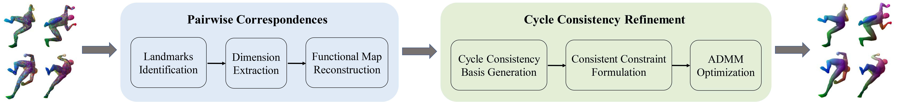

# Multi-Shape Matching with Cycle Consistency Basis via Functional Maps

Matlab implementation for AAAI'25 paper "Multi-Shape Matching with Cycle Consistency Basis via Functional Maps", by Yifan Xia, Tianwei Ye, Huabing Zhou, Zhongyuan Wang and Jiayi Ma.

This paper focuses on multi-shape matching with a more concise cycle consistency formulation. By modeling shapes as directed graphs, we derived cycle consistency basis as constraints. The method employs a two-stage optimization: optimizing pairwise correspondence accuracy via landmarks and refining consistency through cycle consistency basis.



If you find this project useful, please cite:

```
@inproceedings{Xia2025Multi,
  title={Multi-Shape Matching with Cycle Consistency Basis via Functional Maps},
  author={Xia, Yifan and Ye, Tianwei and Zhou, Huabing and Wang, Zhongyuann and Ma, Jiayi},
  booktitle={Proceedings of the AAAI Conference on Artificial Intelligence},
  year={2025}
}
```

## Run the exemplary code

Please unzip the gspbox.zip and utils.zip in this directory. Run demo.m directly.

Note that this demo requires Matlab environment and GPU. (GPU accelerates the KNN, and users can convert to CPU.)

## Contact

Please let us know (twye2001@gmail.com) if you have any question regarding the algorithms/paper or you find any bugs in the implementation.

## Acknowledgement
This implementation of functional map reconstruction is adapted from [MWP](https://github.com/Qinsong-Li/MWP) and the implementation of cycle consistency basis generation is modified from [NeurIPS19_Cycle](https://github.com/huangqx/NeurIPS19_Cycle). We thank the authors for making their codes publicly available.
